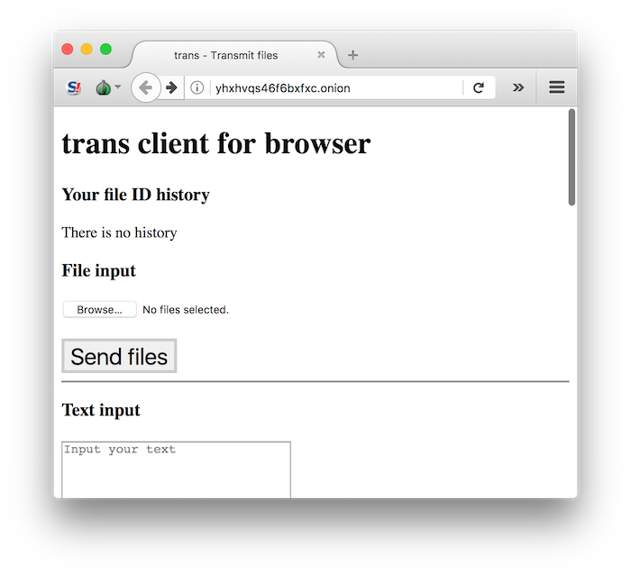

# trans-server-tor-docker-compose

Trans server as [Tor](https://www.torproject.org/) Hidden Service

## Run

Here is how to run Trans server as Tor Hidden Service.

```bash
# Go to this repo
cd <this repo>
# Initialize "tor_hidden_service" for docker volume sharing
./init_shared_tor_hidden_service.sh 
# Run the server
docker-compose up
```

Then, you can check host name by
`cat docker_volumes/tor_hidden_service/hostname ` command.


You can send a file by

```bash
torsocks curl -T ./mytext.txt http://yhxhvqs46f6bxfxc.onion
```

Or you can access to the page like the following on Tor Browser.



